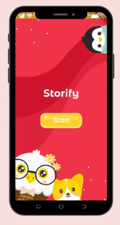
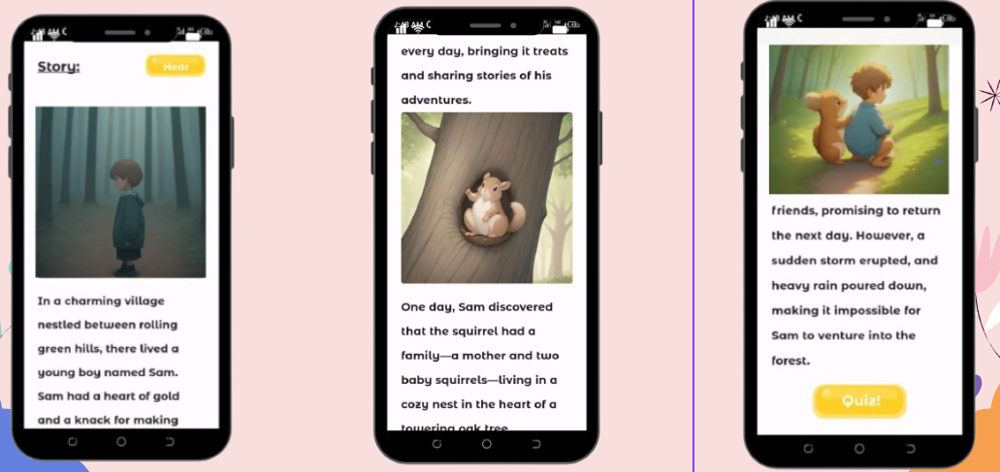
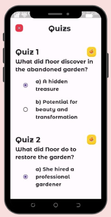
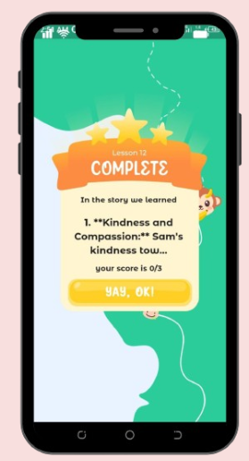

# Storify
Storify is our submission for the Google Assistant Hackathon. It's an app that targets kids from the age of 4 to 18, aiming to provide them with meaningful stories using generative AI.       
If you want to try it out, you should include your API keys.

## Features
- Gemini: Generative text for story generation using prompts.
- Hugging Face: Generative images AI to create visuals from the story.
- Hugging Face: Image-to-caption AI for generating stories from images.
- flutter_ttf: Utilized to convert stories into audio.

## Screenshots 
to lazy ppl like me (XD) who prefer not to compile/download/use the app  :)     

### Mobile:
 
     
     
     

